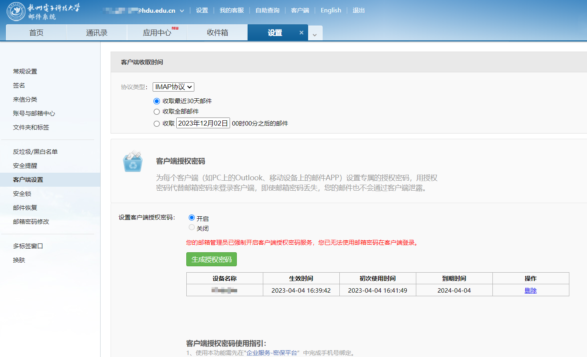

# Exp-Frame
实验室大佬[**GrayWolf**](https://gitee.com/graywolf_lv)实现的深度学习训练框架，本人只负责搬运，添加注释以及readme。  
**功能**：模型训练结束后自动邮件通知，展示训练过程记录。
# 文件说明

## 1、模型接入
[`./experiment/experiment.py`]()模型接入标准，可参照[`./experiment/mf_exp.py`]()实现下列函数：  
```
    def data_load(self):
        raise NotImplementedError

    def model_build(self):
        raise NotImplementedError

    def train(self):
        raise NotImplementedError

    def evaluate(self):
        raise NotImplementedError

    def model_save(self):
        raise NotImplementedError

    def model_load(self):
        raise NotImplementedError
```
## 2、评估
[`./metrics/metrics.py`]中实现了下列评估方法：
```
def ndcg_at_k(pred_scores, ground_truth, k=100):

def recall_at_k(pred_scores, ground_truth, k=100):

def hit_at_k(pred_scores, ground_truth, k=100):
```
## 3、邮件收发
[`./sensitive.py`]()示例文件：
```

email_config = {
    'smtp_server': 'smtphz.qiye.163.com', //SMTP服务器地址，hdu网易邮箱
    'mail_user': 'xxx@hdu.edu.cn',        //用户邮箱
    'mail_pass': 'xxxxxxxxxxxxxx'
}
```
获取mail_pass：

实验结果接收示例：

## 4、数据库设置
用于将数据集存入服务器数据库的情况
```
database_config = {
    'user': 'user10001', //服务器账号
    'password': '*****', /用户密码
    'host': '127.0.0.1',
    'database': 'xxxxx', //数据库名
    'raise_on_warnings': True
}
```